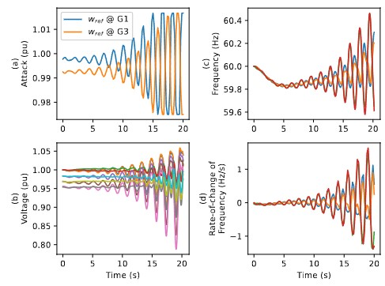

# RL-CPS-attacks
This repo provides the code for the research presented in the 22nd IEEE International Conference on Machine Learning and Applications (ICMLA) 2023 for the paper: Reinforcement Learning for Supply Chain Attacks Against Frequency and Voltage Control

The repo contains the following Python files.

1) `supplyChainEnv.py` builds the RL environment that simulates the power system under attack.

The file contains a simple test script to illustrate the functions in this file in the end. Uncomment and run the file to see.

2) `RLTrain.py` contains script to train RL agents. You can change the reward for the agent under `step()` function in `supplyChainEnv.py`.

## How to start:

1) Install the dependencies. An advanced IDE like PyCharm will do it readily for you. You will need several libraries including `Andes` for power system simulation, `Gym` for the RL environment, and `StableBaselines3` for the RL agent.
2) Uncomment the test script in the end of `supplyChainEnv.py` and run the file to see the testcase.
3) Comment the test script in the end of `supplyChainEnv.py` and run `RLTrain.py` without making any changes to train the RL agent.
4) Train the agent with different actions (attack points) and observations.
5) Change the reward function, RL agent hyperparameters, etc, to configure the training. 

## Example
This is what you can expect to see. In the figure below, the RL agent (simulating a cyberattacker) compromises the control of two generators in the system and currupts their frequency setpoints. The agent then is able to negatively influence the system frequency to the point of power system destabilization. 

More details about the code can be found in 

`@inproceedings{mohamed2023reinforcement,
  title={Reinforcement Learning for Supply Chain Attacks Against Frequency and Voltage Control},
  author={Mohamed, Amr and Lee, Sumin and Kundur, Deepa},
  booktitle={2023 22nd IEEE International Conference on Machine Learning and Applications (ICMLA)},
  year={2023},
  organization={IEEE}
}`

More details about the use of reinforcement learning for attacking and defending the power system can be found in 

`@article{mohamed2023use,
  title={On the Use of Reinforcement Learning for Attacking and Defending Load Frequency Control},
  author={Mohamed, Amr S and Kundur, Deepa},
  journal={arXiv preprint arXiv:2303.15736},
  year={2023}
}`
